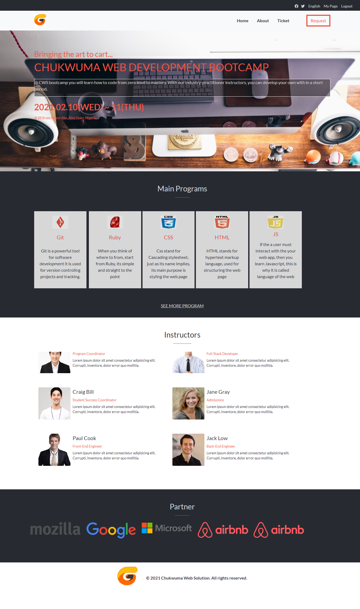
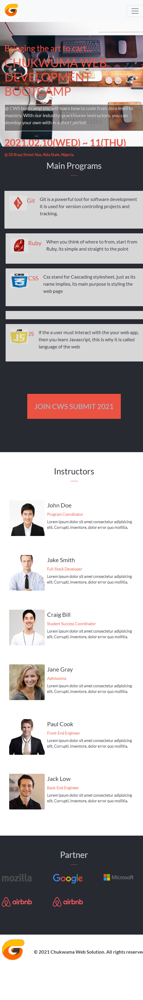

# CWS Development Bootcamp


> This project is my HTML & CSS Capstone Project in Microverse.

The project is a complete design on the CWS Development Bootcamp (Fictional). A design prototype from Cindy Shin [CC Global Summit 2015](https://www.behance.net/gallery/29845175/CC-Global-Summit-2015).

Complete design of the index, about and ticket page designed using Grid, Flexbox, and Position alongside with other CSS concepts.

In this project, CSS styling and bootstrap 4 was used.

I have to follow the challenge breakdown through, without skipping any step.

I used the CSS checkbox trick to implement the mobile menu.


## Built With

- HTML
- CSS
- FontAwesome
- Bootstrap 4






## Live Demo
[Live Demo Link](https://ccobasi.github.io/Conference-Page/index.html)


## Video Description
[Video Description](https://www.loom.com/share/5649e0d868714e09895d3c9bd9f39fec)

## Getting Started

To get a local copy of the repository please run the following commands on your terminal:

```
$ cd <folder>
```

```
$ git clone https://github.com/ccobasi/Conference-Page.git
```


## Future Implementations

> Detailed Program Itinerary Page

## Author

### Chukwuma Obasi

* GitHub: [@ccobasi](https://github.com/ccobasi)
* twitter - https://twitter.com/obasichux


## Show your support

Give a ⭐️ if you like this project!

## Acknowledgments

- UI Design Credits goes to [Cindy Shin - CC Global Summit 2015](https://www.behance.net/gallery/29845175/CC-Global-Summit-2015)
- Project inspired by Microverse Program

